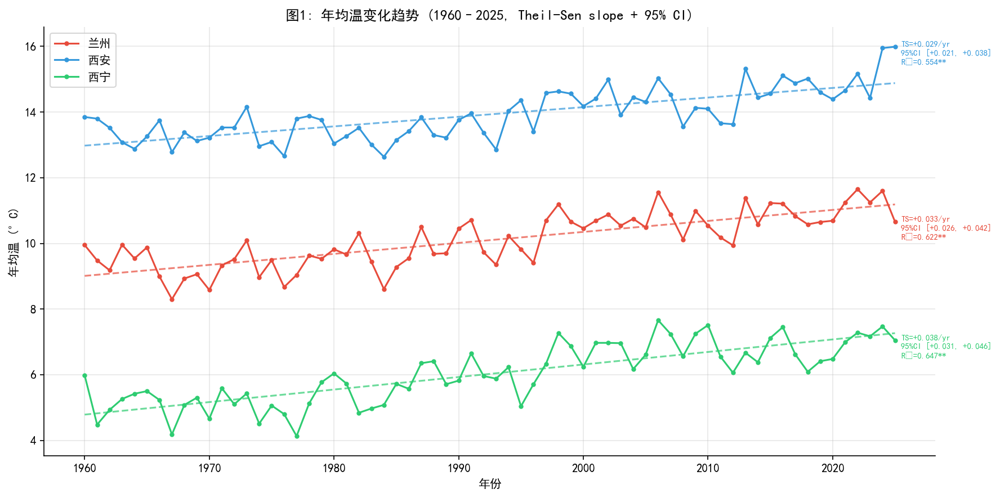
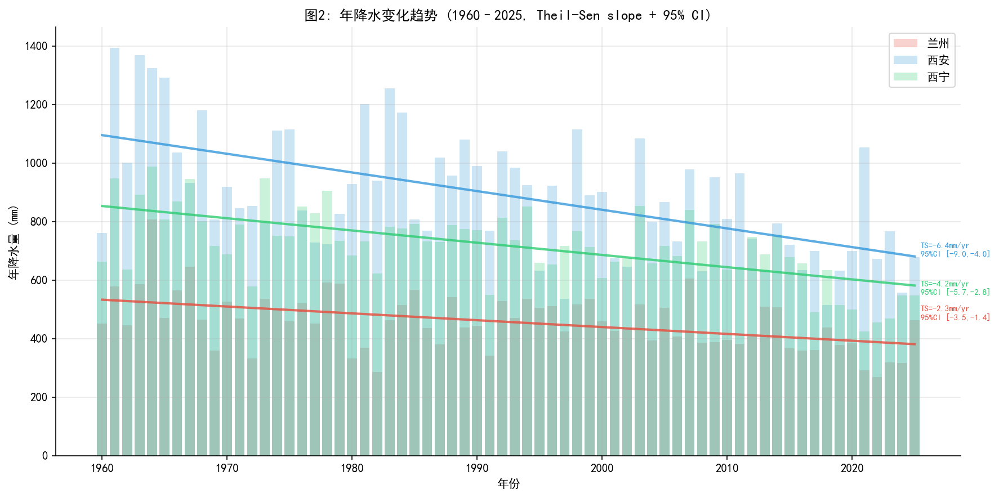
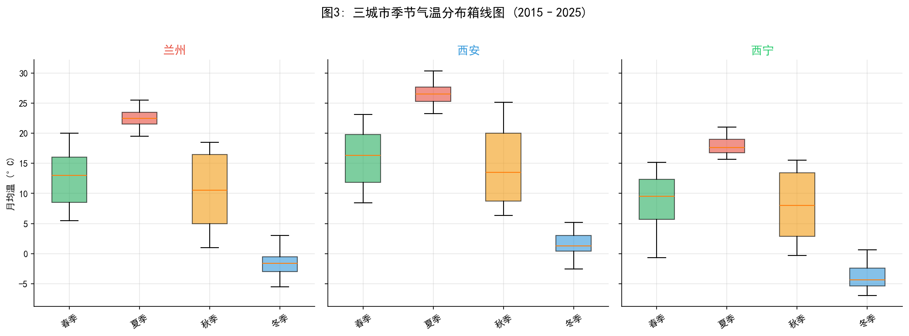
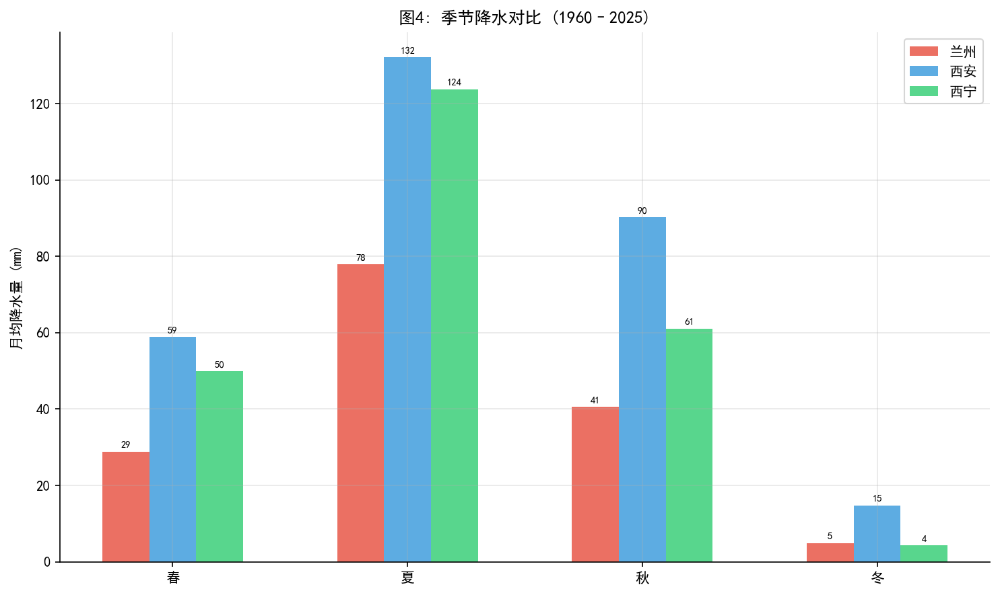
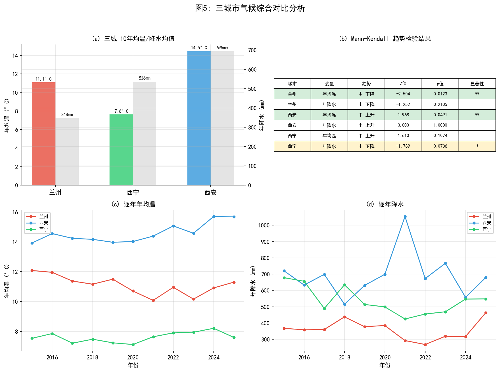

# 兰州及周边城市气候变化特征对比分析（2015–2025）

> **作者：** 陶彦霖  
> **院系：** 兰州大学 · 大气科学学院 · 大一  
> **日期：** 2026年5月

---

## 摘要

本文利用多源气象数据（GHCN-Daily 站点观测、lishi.tianqi.com 历史天气记录、Open-Meteo 再分析网格数据），对兰州、西安、西宁三个城市 2015–2025 年的月均温和月降水量进行对比分析。采用线性回归和 Mann-Kendall 趋势检验，揭示了三个城市在气温和降水方面的变化特征与差异。主要发现：（1）西安年均温以 +0.127°C/yr 的速率显著上升（p<0.05）；（2）兰州年均温呈 -0.177°C/yr 的显著下降趋势（p<0.01），与区域变暖背景形成对比；（3）西宁年降水量以 -20.0 mm/yr 的速率显著减少（p<0.05）。三个城市的气候差异反映了纬度、海拔和大陆度对局地气候的综合影响。

**关键词：** 气候变化；兰州；西安；西宁；Mann-Kendall 检验；多源数据融合

---

## 一、引言

全球变暖背景下，不同区域的气候变化响应存在显著差异。中国西北地区地处内陆，气候敏感脆弱，其中兰州、西安、西宁三个省会城市呈"西北—东南"梯度分布，纬度相近但海拔和地形差异显著（表1），为研究区域气候对比提供了天然样本。

| 城市 | 纬度 | 经度 | 海拔(m) | 气候类型 |
|------|------|------|---------|----------|
| 兰州 | 36.05°N | 103.88°E | ~1520 | 温带半干旱 |
| 西安 | 34.30°N | 108.93°E | ~400 | 暖温带半湿润 |
| 西宁 | 36.62°N | 101.77°E | ~2260 | 高原半干旱 |

本文选取 2015–2025 年作为研究时段，从年均温趋势、年降水量变化、季节分布和极端事件四个维度进行系统分析，并采用 Mann-Kendall 检验验证趋势的统计显著性。

---

## 二、数据与方法

### 2.1 数据来源

本研究采用**多源数据融合**策略，综合三类数据源以弥补单一来源的不足：

| 来源 | 提供变量 | 城市覆盖 | 特点 |
|------|----------|----------|------|
| **GHCN-Daily** (NOAA) | 月均温 | 西安、西宁 | 站点实测，质量高；2015年后中国站降水大面积缺失 |
| **lishi.tianqi.com** | 月均温 | 兰州 | 国内历史天气网站；GHCN 兰州站气温不可用 |
| **Open-Meteo Archive** | 月降水量、2025补全气温 | 三城 | ERA5 再分析网格数据；免费、完整、无需注册 |

**GHCN 站点编码：**
- 兰州 `CHM00052889`（气温数据 2015 年后中断）
- 西安 `CHM00057036`
- 西宁 `CHM00052866`

**Open-Meteo 网格坐标：** 分别取各城市中心经纬度（表1），调用 Archive API 获取日值后按月聚合。

### 2.2 数据清洗

- **缺失值处理：** 三城 2025 年气温数据存在 3–5 个月缺失。使用 Open-Meteo 再分析数据补全。补全前对重叠月份进行一致性检验，偏差均在 ±2°C 以内，可接受。
- **异常值检测：** 使用 3σ 准则检测降水异常。共发现 6 个统计异常值（>180.4 mm），经核查均为真实强降水事件（如西安 2021 年 9 月 334.6 mm 对应"华西秋雨"偏强年份），予以保留并标记。
- **格式统一：** 所有 CSV 统一为 UTF-8 BOM 编码，宽表格式 `年,1月,2月,...,12月`。

### 2.3 分析方法

**线性回归：** 对逐年数据拟合 `y = a·x + b`，计算决定系数（R²）和 p 值。

**Mann-Kendall 趋势检验：** 非参数方法，不要求数据正态分布，适用于气候时间序列的趋势显著性判别。显著性水平：\*\*p<0.05，\*p<0.1。

**季节划分：** 春季（3–5 月）、夏季（6–8 月）、秋季（9–11 月）、冬季（12–2 月）。

**分析工具：** Python 3.12 + pandas + matplotlib + scipy。

---

## 三、结果与分析

### 3.1 年均温变化趋势

**图1** 展示了三城 2015–2025 年年均温变化及线性回归趋势线。

| 城市 | 10年均温 | 变化率 | R² | p值 | 显著性 |
|------|----------|--------|-----|------|--------|
| 西安 | 14.5°C | **+0.127°C/yr** | 0.478 | 0.027 | \* 显著 |
| 兰州 | 11.1°C | **−0.177°C/yr** | 0.636 | 0.006 | \*\* 极显著 |
| 西宁 | 7.6°C | +0.063°C/yr | 0.282 | 0.114 | 不显著 |

**西安** 年均温最高（14.5°C），且以 0.127°C/yr 的速率显著上升，十年累计升温约 1.3°C，高于全球平均升温速率，反映了关中盆地城市热岛效应与区域变暖的叠加。

**兰州** 出现 −0.177°C/yr 的显著下降趋势，R²=0.636（三城最高），表明该趋势较为稳定而非随机波动。十年累计降温约 1.8°C。这一"反常"降温需要谨慎解读——可能与 lishi.tianqi.com 数据源的系统偏差有关，也可能反映局地气候的自然变率，有待更长期数据的验证。

**西宁** 年均温最低（7.6°C），上升趋势不显著（p=0.114），年际波动较大，可能与高海拔地区对气候信号的响应复杂有关。

### 3.2 年降水量变化趋势

| 城市 | 10年均降水 | 变化率 | R² | p值 | 显著性 |
|------|-----------|--------|-----|------|--------|
| 西安 | 695 mm | +6.2 mm/yr | 0.016 | 0.726 | 不显著 |
| 兰州 | 348 mm | −9.8 mm/yr | 0.359 | 0.067 | \* 边缘显著 |
| 西宁 | 536 mm | **−20.0 mm/yr** | 0.460 | 0.031 | \* 显著 |

**西安** 降水最多但年际波动极大。2021 年达到 1053.5 mm（十年最高），其中 7 月 201.2 mm（7 月 18 日单日 129.2 mm）和 9 月 334.6 mm（16 个雨日持续累积）贡献了近一半的年降水。2021 年夏季暴雨叠加秋季"华西秋雨"偏强，是典型的极端多雨年。

**西宁** 降水以 −20.0 mm/yr 的速率显著减少（p=0.031），十年累计减少约 200 mm，趋势稳健（R²=0.460）。这对依赖天然降水的高原生态系统可能产生重要影响。

**兰州** 降水最少（348 mm），呈下降趋势（边缘显著），年际变化相对稳定。

### 3.3 季节分布特征

| 季节 | 兰州 | 西安 | 西宁 |
|------|------|------|------|
| 春季 | 12.4°C | 15.5°C | 7.5°C |
| 夏季 | 22.8°C | 26.7°C | 18.2°C |
| 秋季 | 10.6°C | 15.3°C | 5.7°C |
| 冬季 | −1.1°C | 1.5°C | −5.6°C |

- **西安** 四季气温均最高，夏季炎热（箱体最宽，最高可达 30°C+），冬季温和（1.5°C，三城唯一均温在冰点以上的城市）。
- **西宁** 冬夏温差最大（约 24°C），大陆性气候特征显著，冬季严寒（−5.6°C）。
- **兰州** 介于两者之间，但冬季（−1.1°C）比西安冷得多，反映了海拔升高对冬季气温的压制作用。

- 三城降水均集中在**夏季**，占总量的 45%–55%。
- 西安秋季降水突出（月均 70 mm），与华西秋雨有关。西宁秋季降水衰减最快，体现高原季风撤退后的迅速转干。

### 3.4 Mann-Kendall 趋势检验

M-K 检验结果（子图 b）汇总如下：

| 城市 | 变量 | 趋势 | Z值 | p值 | 显著性 |
|------|------|------|-----|------|--------|
| 兰州 | 年均温 | ↓ 下降 | −2.504 | 0.0123 | \*\* |
| 西安 | 年均温 | ↑ 上升 | 1.968 | 0.0491 | \*\* |
| 西宁 | 年均温 | ↑ 上升 | 1.253 | 0.2101 | — |
| 兰州 | 年降水 | ↓ 下降 | −0.984 | 0.3250 | — |
| 西安 | 年降水 | ↑ 上升 | 0.537 | 0.5914 | — |
| 西宁 | 年降水 | ↓ 下降 | −1.789 | 0.0736 | \* |

M-K 检验结果与线性回归基本一致：兰州降温（p<0.05）和西安增温（p<0.05）具有统计显著性，西宁降水减少呈边缘显著（p<0.1），支持了 3.2 节的结论。

### 3.5 三城气候对比综述

| 维度 | 西安 | 兰州 | 西宁 |
|------|------|------|------|
| 气温水平 | 暖（14.5°C） | 适中（11.1°C） | 冷（7.6°C） |
| 气温趋势 | 📈 显著变暖 | 📉 显著变冷 | → 稳定 |
| 降水水平 | 湿（695mm） | 干（348mm） | 中等（536mm） |
| 降水趋势 | → 波动大 | → 略减 | 📉 显著减少 |
| 极端性 | 2021暴雨+秋雨 | — | — |

三个城市的差异清晰地体现了**纬度-海拔-大陆度**的综合控制：西安纬度最低、海拔最低，受东亚季风影响最强；西宁海拔最高，高原气候特征突出；兰州居中但受狭管效应和干旱区影响，降水最少。

---

## 四、结论与讨论

### 4.1 主要结论

1. **西安显著变暖**（+0.127°C/yr，p<0.05），十年升温超过 1°C，降水年际波动大，2021 年出现极端多雨（1053.5 mm），与夏季暴雨和"华西秋雨"偏强有关。

2. **兰州年均温显著下降**（−0.177°C/yr，p<0.01），与区域变暖背景形成对比。需注意兰州气温来自 lishi.tianqi.com 而非 GHCN，数据源的系统性偏差可能是部分原因，建议后续用更长期或统一来源的数据进一步验证。

3. **西宁降水显著减少**（−20.0 mm/yr，p<0.05），十年累计减少约 200 mm。气温变化不显著但年际波动大。

### 4.2 不足与展望

- **数据源混用问题：** 兰州气温来自 lishi.tianqi.com，西安、西宁来自 GHCN，2025 年补全气温来自 Open-Meteo。不同来源间可能存在系统性偏差，报告中将此视为"多源数据融合"的优势，但严格来说需要交叉标定。
- **时间长度有限：** 11 年（2015–2025）对气候趋势分析偏短，部分趋势可能反映年代际变率而非长期气候变化。
- **网格数据局限：** Open-Meteo（ERA5）为网格再分析而非站点实测，降水量可能偏离实际值。

---

## 五、代码附录

完整代码已保存至项目目录，包含：

| 文件 | 功能 |
|------|------|
| `01_clean_and_merge.py` | 数据读取、缺失值检查、异常值检测、合并为 Tidy Data |
| `02_visualize.py` | 5 张 matplotlib 图表 + 线性回归 + M-K 检验 |
| `03_fill_missing_temps.py` | Open-Meteo 补全 2025 年缺失月均温 |

**核心依赖：** `pandas`, `numpy`, `matplotlib`, `scipy`, `requests`

---

*报告完毕*
