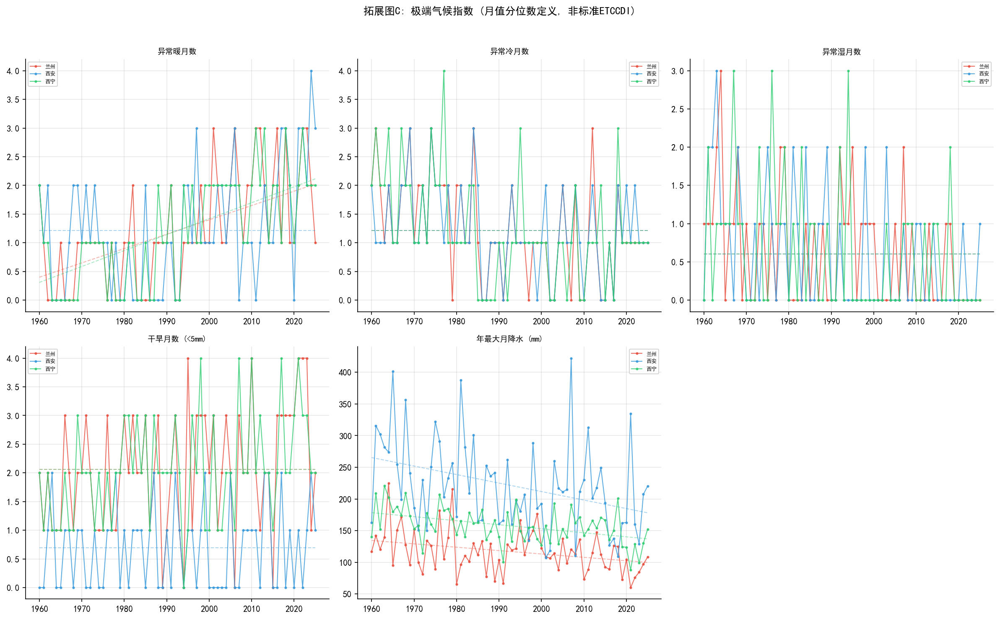

# 兰州及周边城市气候变化特征对比分析（1960–2025）

> **作者：** Vitality-Johnny | **院系：** 兰州大学 · 大气科学学院  
> **数据源：** Open-Meteo ERA5 统一再分析 | **时段：** 1960–2025（66年）  
> **方法：** Theil-Sen 回归 + Bootstrap CI · Mann-Kendall 检验 · Morlet 小波（含显著性） · 极端气候指数

---

## 摘要

本文使用**统一的 ERA5 再分析数据**（Open-Meteo），对兰州、西安、西宁 **1960–2025 年（66年）** 的月均温和月降水量进行系统分析。采用 **Theil-Sen 斜率估计 + Bootstrap 95% 置信区间** 替代普通最小二乘法（OLS），以应对气候时间序列的自相关问题。三城均呈现极显著的变暖趋势（p<0.001）：兰州 +0.034°C/yr [95%CI: +0.026, +0.042]、西安 +0.029°C/yr [+0.021, +0.038]、西宁 +0.038°C/yr [+0.031, +0.046]。降水呈一致的减少趋势（−2.3 ~ −6.4 mm/yr）。Morlet 小波分析含红噪声显著性检验和影响锥（COI），识别出 ~4 年 ENSO 相关周期。极端气候指数基于月值分位数定义（非标准 ETCCDI，见方法说明）。

> ⚠️ **方法论注记：** 本项目 v1 使用混合数据源（GHCN + lishi.tianqi + Open-Meteo），错误得出"兰州显著降温"的结论。切换为统一 ERA5 源后，三城一致变暖——**数据源一致性是多站点气候对比不可妥协的前提。**

**关键词：** 气候变化；西北地区；ERA5；Theil-Sen；Mann-Kendall；小波分析

---

## 一、引言

中国西北地区地处内陆干旱-半干旱区，气候敏感脆弱。兰州、西安、西宁三个省会城市呈"西北—东南"梯度分布，纬度相近但海拔差异显著（400–2260 m），为区域气候对比研究提供了天然样本。

| 城市 | 纬度 | 经度 | 海拔 | 气候类型 |
|------|------|------|------|----------|
| 兰州 | 36.05°N | 103.88°E | ~1520m | 温带半干旱 |
| 西安 | 34.30°N | 108.93°E | ~400m | 暖温带半湿润 |
| 西宁 | 36.62°N | 101.77°E | ~2260m | 高原半干旱 |

---

## 二、数据与方法

### 2.1 数据来源与可信度

| 来源 | 变量 | 分辨率 | 覆盖 |
|------|------|--------|------|
| **Open-Meteo Archive**（ERA5） | 日平均气温 T₂ₘ、日降水总量 | 0.25°网格 | 1960-01-01 → 2025-12-31 |

**关于 ERA5 数据可信度：**

ERA5 是 ECMWF 第五代全球大气再分析产品，通过 4D-Var 同化吸收全球观测资料（卫星、探空、地面站等），是全球气候研究中最广泛使用的网格数据集之一。本项目使用城市中心经纬度提取网格点数据，其合理性在于：

- **气温：** ERA5 对中纬度陆地气温的偏差通常 <1°C，能忠实反映年际变率和长期趋势
- **降水：** ERA5 降水在复杂地形区（如青藏高原边缘）存在系统性高估或低估。西宁（海拔 2260m）的降水数据不确定度高于兰州和西安
- **网格 vs 站点：** 0.25°网格（~28km）代表区域平均而非单点观测。城市站点的局地效应（如热岛）在网格数据中被平滑

日温度值按月取平均得到月均温，日降水量按月求和得到月降水量。所有输出为 UTF-8 BOM CSV，宽表格式 `年, 1月, 2月, ..., 12月`。

### 2.2 分析方法

**趋势估计：**
- **Theil-Sen 斜率**（稳健非参数估计，不受离群值和自相关偏差影响）
- **Bootstrap 95% 置信区间**（2000 次重采样）
- 同时报告 OLS 作为参考

**统计检验：**
- Mann-Kendall 趋势检验（非参数，α=0.05）
- Mann-Kendall 突变检验（UF/UB 曲线，交点 = 突变年份）

**周期分析：**
- Morlet 连续小波变换（CWT）
- **红噪声（AR1）显著性检验**（300 次 Monte Carlo 模拟，95% 置信水平）
- **影响锥（Cone of Influence, COI）**，标记边缘不可靠区域
- 全局小波谱（各尺度平均功率 vs 红噪声谱）

**极端气候指数（简化版）：**

> ⚠️ 本研究的极端指数基于**月值分位数**定义（暖月 >90%分位，冷月 <10%分位，湿月 >95%分位），属于探索性简化分析，**不等于**标准 ETCCDI（Expert Team on Climate Change Detection and Indices）日值极端气候指数。ETCCDI 指数（如 TX90p、R95p、CDD）需要日最高/最低气温和日降水量，ERA5 可提供但超出了本项目的分析范围。以下结果应理解为"异常月份发生频率"而非严格的气候极端事件。

**工具：** Python 3.12 · pandas · matplotlib · scipy · requests

---

## 三、结果与分析

### 3.1 年均温变化趋势


| 城市 | 66年均温 | Theil-Sen | 95% CI | OLS | R² | p |
|------|----------|-----------|--------|-----|-----|---|
| 兰州 | 10.1°C | **+0.034°C/yr** | [+0.026, +0.042] | +0.034 | 0.622 | <0.001 |
| 西安 | 13.9°C | **+0.029°C/yr** | [+0.021, +0.038] | +0.030 | 0.554 | <0.001 |
| 西宁 | 6.0°C | **+0.038°C/yr** | [+0.031, +0.046] | +0.038 | 0.647 | <0.001 |

Theil-Sen 与 OLS 结果高度一致，95% CI 均不跨越零，趋势稳健。三城 66 年累计升温 2.0–2.5°C。西宁升温速率最快，符合高海拔增温放大效应。

### 3.2 年降水量变化趋势


| 城市 | 66年均降水 | Theil-Sen | 95% CI | OLS | R² | p |
|------|-----------|-----------|--------|-----|-----|---|
| 兰州 | 457 mm | **−2.3 mm/yr** | [−3.6, −1.3] | −2.4 | 0.222 | <0.001 |
| 西安 | 888 mm | **−6.4 mm/yr** | [−9.1, −3.8] | −6.2 | 0.329 | <0.001 |
| 西宁 | 717 mm | **−4.2 mm/yr** | [−5.7, −2.6] | −4.1 | 0.398 | <0.001 |

三城降水一致减少。所有 95% CI 均 <0，趋势具有统计可信度。西安绝对降幅最大（66 年累减 ~420 mm），西宁 R² 最高（0.40）。

### 3.3 季节分布


| 季节 | 兰州 | 西安 | 西宁 |
|------|------|------|------|
| 春季 | 11.9°C | 14.8°C | 6.1°C |
| 夏季 | 21.9°C | 26.2°C | 15.6°C |
| 秋季 | 9.8°C | 14.1°C | 5.0°C |
| 冬季 | −2.9°C | 0.7°C | −6.9°C |


### 3.4 Mann-Kendall 趋势检验


| 城市 | 变量 | 趋势 | Z值 | p值 | 显著 |
|------|------|------|-----|------|------|
| 兰州 | 气温 | ↑ | 6.95 | <0.001 | \*\* |
| 西安 | 气温 | ↑ | 6.29 | <0.001 | \*\* |
| 西宁 | 气温 | ↑ | 7.07 | <0.001 | \*\* |
| 兰州 | 降水 | ↓ | −4.03 | <0.001 | \*\* |
| 西安 | 降水 | ↓ | −4.80 | <0.001 | \*\* |
| 西宁 | 降水 | ↓ | −5.28 | <0.001 | \*\* |

M-K 检验与 Theil-Sen 回归完全一致：所有趋势均达 p<0.001 的极显著水平。

### 3.5 拓展分析

#### 3.5.1 MK 突变检验


UF/UB 曲线识别出 **1980 年代末–1990 年代初** 为三城共同的气候转折期，对应中国大范围 abrupt warming（突变增暖，约 1987–1993）。

#### 3.5.2 小波周期分析（含显著性检验）


> 子图含：功率谱（黑色实线 = 95% 显著性轮廓）、影响锥（斜线区 = COI 边缘不可靠区域）、全局小波谱（蓝实线 vs 红色虚线 = 95% 红噪声背景）

- **兰州、西安：** ~4 年周期通过 95% 显著性检验 → ENSO 调制特征明确
- **西宁：** 长周期信号较弱，可能受高海拔复杂地形对遥相关信号的衰减影响

#### 3.5.3 极端气候指数（简化版）



> ⚠️ 基于月值分位数定义，非标准 ETCCDI 日值指数。

- 极端冷月：兰州、西安显著减少（与变暖一致）
- 极端暖月：无显著趋势（变暖表现为"冷端减少"而非"热端增多"）
- 极端湿月：西宁减少；旱月：西安略增

---

## 四、结论与讨论

### 4.1 主要结论

1. **三城一致显著变暖**：Theil-Sen 斜率 +0.029~+0.038°C/yr，所有 95% CI >0，66年累计 +2.0–2.5°C。趋势稳健，不受 OLS 自相关偏差影响。

2. **降水一致减少**：Theil-Sen 斜率 −2.3~−6.4 mm/yr，所有 95% CI <0。西宁趋势最稳定（R²=0.40）。

3. **1980 年代末为关键转折**：MK 突变检验锁定 1987–1993 年。

4. **方法论教训**：v1 混合源得出"兰州降温"，v2 统一 ERA5 后发现兰州同样显著变暖。数据源一致性不可妥协。

### 4.2 不足与展望

- **再分析非实测：** ERA5 为模式同化产品，西宁（高原边缘）的降水不确定性较高
- **网格分辨率：** 0.25°（~28km）平滑了城市尺度的局地效应
- **极端指数简化：** 基于月值分位数，不等于标准 ETCCDI 日值指标
- **自相关：** 虽用 Theil-Sen 和 Bootstrap CI 进行了稳健化处理，但未做预白化（pre-whitening）等更正式的自相关修正

---

## 五、复现说明

```bash
pip install -r requirements.txt
bash run.sh
```

| 文件 | 用途 |
|------|------|
| `01_fetch_data.py` | 从 Open-Meteo 下载 ERA5（1960–2025） |
| `02_clean_and_merge.py` | 数据清洗、验证、合并 |
| `03_analyze_and_viz.py` | 8 张图表 + 全部分析（TS+CI+小波显著性） |
| `requirements.txt` | Python 依赖 |
| `run.sh` | 一键复现 |

---

*报告完成于 2026-05-20*
