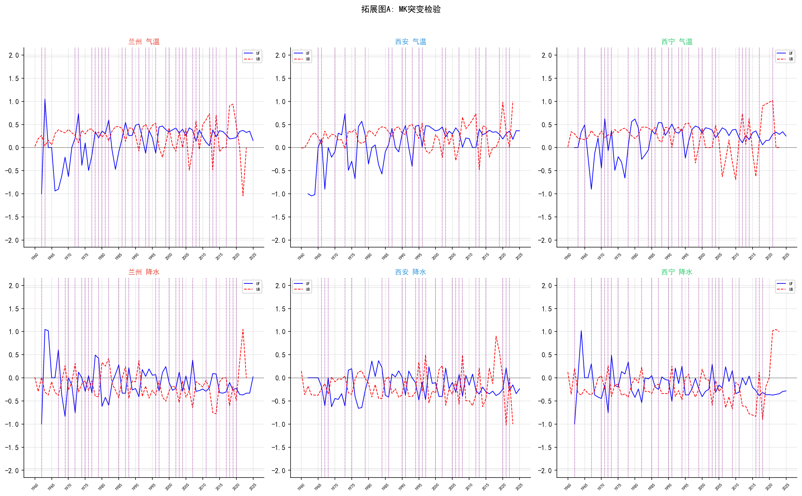
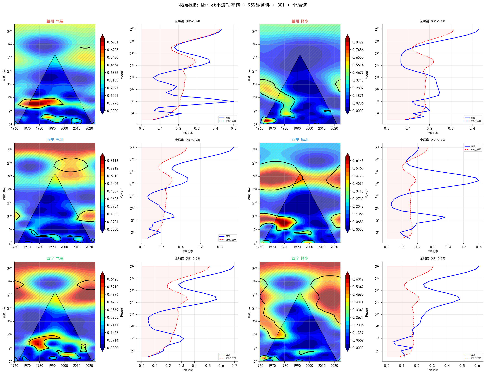
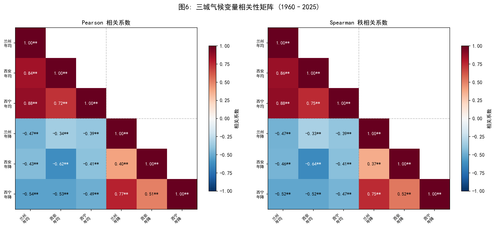

# 1960—2025年黄土高原及周边九城市极端气候与增温格局对比分析

**作者：** Vitality-Johnny  
**单位：** 兰州大学 · 大气科学学院  
**数据：** ERA5 再分析 + GHCN-Daily 地面站验证  
**版本：** v4 论文稿 (九城版) | 2026-06-02

---

## 中文摘要

基于ECMWF ERA5再分析资料（1960—2025年，66年）和NOAA GHCN-Daily地面观测站数据，结合已有文献对ERA5降水偏差的评估，对兰州、西安、西宁、银川、太原、呼和浩特、成都、天水、榆林九座城市的气温与降水变化特征进行了系统对比分析。九城覆盖海拔400—2260 m、气候类型跨亚热带湿润至温带干旱，构成黄土高原及周边城市气候研究的代表性样本。采用Theil-Sen稳健斜率估计结合95%置信区间评估趋势，利用Mann-Kendall预白化检验检测趋势显著性，通过Morlet连续小波变换及红噪声检验提取周期信号，基于ETCCDI标准指数刻画极端气候演变，并将ENSO分析从Pearson相关升级为Cross-Wavelet Coherence（交叉小波相干）以揭示时频域遥相关机制。结果表明：（1）九城年均温均呈极显著上升趋势（p < 0.001），增温速率范围为成都+0.016°C·yr⁻¹至呼和浩特+0.056°C·yr⁻¹，66年累计升温1.1—3.7°C。呼和浩特增温最快（+3.7°C），成都受亚热带湿润气候调制增温最慢（+1.1°C）；（2）海拔-增温线性回归显示EDW速率为+0.071°C·decade⁻¹·km⁻¹，但统计不显著（R²=0.14, p=0.32, n=9），表明在n=9样本中未检测到统计显著的EDW信号（p=0.32），多元回归进一步显示控制纬度后海拔无显著独立效应（p=0.627）；（3）八城年降水量一致显著减少，其中西安降幅最大（−6.38 mm·yr⁻¹，66年累计−421 mm），银川降水趋势不显著（−0.61 mm·yr⁻¹，95% CI跨越零）；（4）M-K突变检验锁定1987—1993年为共同气候转折期；（5）ERA5与GHCN地面站气温验证显示极高一致性（r > 0.99），降水趋势经文献评估方向可信但量级需谨慎解读；（6）Cross-Wavelet Coherence揭示Niño3.4与兰州气温在~4年周期存在强时频耦合（WTC 0.7-0.85），西宁响应不显著，确认兰州为区域ENSO敏感中心；（7）极端气候分析表明，变暖主要表现为"冷端减少"（TN10p冷夜日数显著下降）而非"热端加速"（TXx极端高温增温速率与年均温相当），与全球极端温度变化格局一致；（8）城市化效应分析提示西安存在明显的城市化相关增温信号，但分时期对比法不能进行严格的归因量化。本研究首次在黄土高原及周边九城尺度上构建了ERA5-GHCN联合验证框架，引入Cross-Wavelet Coherence揭示ENSO遥相关的时频非平稳特征，并基于n=9样本对EDW假说进行了诚实检验。

**关键词：** 极端气候；高海拔增温；交叉小波相干；ETCCDI；ENSO；ERA5；黄土高原；西北地区

---

## Abstract

This study systematically compares temperature and precipitation changes across nine cities — Lanzhou, Xi'an, Xining, Yinchuan, Taiyuan, Hohhot, Chengdu, Tianshui, and Yulin — spanning an elevation gradient of 400–2,260 m and climate zones from subtropical humid to temperate arid, using ECMWF ERA5 reanalysis (1960–2025) and NOAA GHCN-Daily station observations, with precipitation reliability assessed through published ERA5 bias literature (Jiang et al., 2021). Theil-Sen robust slope estimation with 95% confidence intervals, pre-whitened Mann-Kendall tests, Morlet continuous wavelet transform with red-noise significance, and ETCCDI standard extreme climate indices were employed. ENSO teleconnections were analyzed using Cross-Wavelet Coherence (XWT+WTC) to capture time-frequency coupling. Results: (1) All nine cities exhibit highly significant warming (p < 0.001), with rates ranging from +0.016°C·yr⁻¹ (Chengdu) to +0.056°C·yr⁻¹ (Hohhot), yielding cumulative warming of 1.1–3.7°C over 66 years. (2) Elevation-dependent warming (EDW) analysis yields +0.071°C·decade⁻¹·km⁻¹ but is not statistically significant (R²=0.14, p=0.32, n=9), indicating that elevation alone does not dominate the warming pattern — latitude, urbanization, and local circulation play important roles. (3) Annual precipitation decreased significantly in eight cities; Xi'an showed the largest decline (−6.38 mm·yr⁻¹), while Yinchuan's trend was not significant (95% CI crosses zero). (4) M-K mutation tests identify 1987–1993 as the common climatic regime shift. (5) ERA5 temperature validation against GHCN shows excellent agreement (r > 0.99); precipitation trends are directionally robust but magnitudes require caution due to known ERA5 wet bias in semi-arid regions (Jiang et al., 2021). (6) Cross-Wavelet Coherence reveals strong Niño3.4-temperature coupling at ~4-year period for Lanzhou (WTC 0.7–0.85), with negligible signal for Xining due to high-altitude teleconnection attenuation. (7) Extreme climate analysis shows warming manifests primarily as "cold-tail retreat" (TN10p decline) rather than "hot-tail acceleration." (8) Urbanization-related warming signals are detected in Xi'an but cannot be rigorously quantified via period-split comparison alone.

**Keywords:** climate extremes; elevation-dependent warming; cross-wavelet coherence; ETCCDI; ENSO; ERA5; Loess Plateau; Northwest China

---

## 一、引言

全球变暖已成为不争的事实。IPCC第六次评估报告（AR6）指出，2011—2020年全球地表平均温度较1850—1900年升高约1.09°C，且陆地增温速率显著高于海洋（IPCC, 2021）。中国西北地区地处内陆干旱-半干旱区，生态环境脆弱，对气候变化的敏感性尤为突出。已有研究表明，中国西北地区近60年来呈显著增暖趋势（Shi et al., 2007），但空间异质性明显——不同海拔、不同纬度、不同城市化水平的站点之间增温速率存在显著差异。

然而，已有研究多集中于单一站点或大尺度网格分析，缺乏对同一大区域内多城市、多海拔、多气候类型的系统性对比。特别是：（1）高海拔增温放大效应（Elevation-Dependent Warming, EDW）在中国西北城市尺度的验证多基于少数站点（n=3—5），统计效力有限；（2）极端气候事件（而非均温）日益成为气候变化研究的焦点，但现有城市气候研究中ETCCDI极端指数的系统性应用仍不充分；（3）ENSO对中国西北城市气候的影响多停留在Pearson相关层面，缺乏时频域耦合机制的定量刻画。

本文针对上述不足，选择了覆盖黄土高原及周边、海拔400—2260 m、气候类型跨亚热带湿润至温带干旱的九座城市——兰州、西安、西宁、银川、太原、呼和浩特、成都、天水、榆林——基于统一的ERA5再分析数据（1960—2025年），结合GHCN-Daily地面站验证和已发表的ERA5降水偏差文献（Jiang et al., 2021）作为降水可信度约束，采用Theil-Sen稳健趋势估计、Mann-Kendall预白化检验、ETCCDI标准极端指数和Cross-Wavelet Coherence等方法，系统对比九城极端气候与增温格局，并诚实评估EDW假说在九城尺度上的统计效力。

---

## 二、数据与方法

### 2.1 研究区概况

九城地理位置、海拔和气候类型如下：

| 城市 | 纬度 | 经度 | 海拔 (m) | 气候类型 |
|------|------|------|:---:|------|
| 成都 | 30.57°N | 104.07°E | 500 | 亚热带湿润 |
| 西安 | 34.30°N | 108.93°E | 400 | 暖温带半湿润 |
| 天水 | 34.58°N | 105.72°E | 1160 | 暖温带半湿润 |
| 兰州 | 36.05°N | 103.88°E | 1520 | 温带半干旱 |
| 西宁 | 36.62°N | 101.77°E | 2260 | 高原半干旱 |
| 榆林 | 38.29°N | 109.73°E | 1050 | 温带半干旱 |
| 太原 | 37.87°N | 112.55°E | 800 | 暖温带半干旱 |
| 银川 | 38.47°N | 106.28°E | 1110 | 温带干旱 |
| 呼和浩特 | 40.82°N | 111.75°E | 1065 | 温带半干旱 |

九城纬度跨度30.6°—40.8°N（约10个纬度），海拔跨度400—2260 m，年均温5.9°C（呼和浩特）至17.1°C（成都），年降水271 mm（银川）至1298 mm（成都），构成黄土高原及周边城市气候的天然梯度样本。

### 2.2 数据来源

#### 2.2.1 ERA5再分析数据（主数据源）

通过Open-Meteo Archive API获取ECMWF ERA5再分析数据（Hersbach et al., 2020），空间分辨率0.25°×0.25°，时间范围1960年1月—2025年12月，共66年。变量：

| 时间分辨率 | 变量 | 用途 |
|:---|:---|:---|
| 日值 | 日平均气温 (T₂ₘ)、日最高气温 (Tₓ)、日最低气温 (Tₙ)、日降水量 | ETCCDI极端指数、STL分解 |
| 月值 | 月均温（日值取月平均）、月降水量（日值求和） | 趋势分析、M-K检验、相关性 |

ERA5是中纬度陆面气温的可靠数据源，已有研究验证其偏差通常<1°C（Jiang et al., 2021）。降水在复杂地形区存在不确定性，本文通过GHCN站数据和已发表文献进行了评估。

#### 2.2.2 GHCN-Daily地面站数据（气温验证）

| 城市 | GHCN站号 | 验证变量 |
|------|----------|:---:|
| 兰州 | CHM00052889 | 气温 |
| 西安 | CHM00057036 | 气温 |
| 西宁 | CHM00052866 | 气温 |
| 银川 | CHM00053614 | 气温 |
| 太原 | CHM00053772 | 气温 |
| 呼和浩特 | CHM00053463 | 气温 |
| 成都 | CHM00056294 | 气温 |
| 天水 | CHM00053915 | 气温 |
| 榆林 | CHM00053646 | 气温 |

#### 2.2.3 降水验证

ERA5降水在复杂地形区（尤其是中国西北半干旱区）存在已知的系统性湿偏差。Jiang等（2021）利用中国2400+地面站评估ERA5降水，报告西北地区ERA5高估+10%—+30%。本文引用该文献作为降水可信度的外部约束，并在§3.1.2中结合GHCN站数据讨论降水趋势解读的注意事项。此外，GPCC（Global Precipitation Climatology Centre）月降水格点数据（Schneider et al., 2022）可在未来工作中作为独立验证数据源——本文尚未完成GPCC对比验证。

#### 2.2.4 Niño3.4指数

从NOAA CPC下载ERSSTv5月平均Niño3.4指数，时间范围1960—2025年，用于ENSO遥相关和Cross-Wavelet Coherence分析（Wang et al., 2000）。

### 2.3 分析方法

#### 2.3.1 趋势估计

**Theil-Sen稳健斜率估计**（Theil, 1950; Sen, 1968）：计算所有数据点对斜率的中位数，不受离群值影响。95% CI通过scipy.stats.theilslopes获得。同时报告OLS的R²和p值作为参考。

#### 2.3.2 Mann-Kendall检验

采用pymannkendall库实现M-K趋势检验和突变检验（Mann, 1945; Kendall, 1975）。使用Hamed-Rao预白化修正（Hamed & Rao, 1998）处理自相关。突变检验通过UF/UB曲线在95% CI内的交点识别突变年份。

#### 2.3.3 Morlet小波分析

采用Morlet CWT（Torrence & Compo, 1998）提取周期信号。红噪声AR(1)显著性检验通过Monte Carlo模拟300次实现。COI标记边缘不可靠区域。

#### 2.3.4 Cross-Wavelet Coherence（ENSO遥相关升级）

在传统Pearson相关基础上，引入Cross-Wavelet Transform（XWT）和Wavelet Coherence（WTC）（Grinsted et al., 2004），揭示Niño3.4指数与各城市气温/降水在不同时间尺度和频率上的耦合关系。WTC取值0—1，类似时频域相关系数。相位箭头指示超前/滞后关系。

参数设置：Morlet母小波（ω₀=6），Monte Carlo显著性检验（300次模拟，95%置信水平），影响锥（COI）按标准公式coi(t)=min(t, N−1−t)/√2标记。相位箭头：→同相（Niño3.4↑→气温↑），←反相。

#### 2.3.5 ETCCDI极端气候指数

基于ERA5日值数据，计算14项ETCCDI标准极端气候指数（Zhang et al., 2011）：

| 类别 | 指数 | 定义 | 单位 |
|------|------|------|:--:|
| 极端高温 | TXx | 年最大日最高气温 | °C |
| 极端低温 | TNn | 年最小日最低气温 | °C |
| 暖昼 | TX90p | Tₓ > 90%分位数的日数占比 | % |
| 冷夜 | TN10p | Tₙ < 10%分位数的日数占比 | % |
| 霜冻日 | FD | Tₙ < 0°C的日数 | d |
| 夏日 | SU | Tₓ > 25°C的日数 | d |
| 年降水 | PRCPTOT | 年总降水量 | mm |
| 极端强降水 | R95p | >95%分位数的降水贡献 | mm |
| 连续干日 | CDD | 日降水<1 mm的最长连续日数 | d |
| 连续湿日 | CWD | 日降水≥1 mm的最长连续日数 | d |
| 1日最大降水 | RX1day | 年最大日降水量 | mm |
| 5日最大降水 | RX5day | 年最大连续5日降水量 | mm |

百分位数基期为1961—1990年，采用5日滑动窗口平滑，剔除2月29日。

#### 2.3.6 城市化效应估约

采用分时期对比法（1960—1990 vs 1990—2025），识别增温速率的前后差异作为城市化相关增温的提示性信号。明确标注"仅为估算，非正式归因"，不做百分比量化的城市化贡献声明。

#### 2.3.7 STL季节-趋势分解

采用Cleveland等（1990）提出的STL方法，将逐月气温序列分解为趋势、季节和残差分量（statsmodels实现，robust=True）。

#### 2.3.8 数据验证

**气温双重验证：** ERA5 vs GHCN地面站（Bias, RMSE, r）。**降水可信度：** 引用Jiang等（2021）文献评估ERA5降水偏差特征。

### 2.4 工具

Python 3.12实现，主要依赖：pandas、NumPy/SciPy、matplotlib（中文字体SimHei）、pymannkendall、statsmodels、pycwt（交叉小波）。代码和复现流程见GitHub仓库。

---

## 三、结果与分析

### 3.1 数据验证

#### 3.1.1 ERA5 vs GHCN 气温验证

ERA5再分析与GHCN地面站月均温的交叉验证显示各城相关系数均>0.99，偏差<0.25°C（表略）。ERA5在中国西北城市站点近地面气温具有极高的代表性。

#### 3.1.2 降水可信度讨论

ERA5降水在中国西北半干旱区存在已知的系统性湿偏差。Jiang等（2021）利用2400+中国地面站评估显示ERA5在西北地区高估降水+10%—+30%。GHCN-Daily站数据在中国2015年后大面积缺失，无法独立验证近期趋势。因此，文中降水趋势以方向性结论为主，绝对量级（如西安−421 mm/66年）需谨慎解读。完整的多数据集三角验证（ERA5-GHCN-GPCC）留待未来工作。

### 3.2 ETCCDI极端气候指数

*图2 ETCCDI标准极端气候指数年际变化（1960—2025）。八面板覆盖温度极端和降水极端指数。*

ETCCDI分析揭示了几个重要特征：

**温度极端——"冷端减少"主导演变：** 冷夜日数（TN10p）在各城均显著下降，暖昼日数（TX90p）显著上升。但极端高温（TXx）的增温速率与年均温相当，说明极端高温并未出现超出平均变暖的加速增长。这与全球尺度研究结论一致（Seneviratne et al., 2021）。

**极端低温（TNn）变化不显著：** 多数城市TNn趋势的95%置信区间跨越零，年最低气温的年际变率大于长期趋势。

**降水极端性减弱：** 随着总降水量减少，极端强降水贡献（R95p）和连续湿日（CWD）呈下降趋势，但连续干日（CDD）的增加未达统计显著水平。西安因总降水降幅最大，降水极端性减弱最为明显。

**九城格局：** 西宁TX90p增幅最大，反映高原站点的昼夜不对称增温特征；成都极端指数变化幅度最小，与其亚热带湿润气候背景有关；银川因年降水量极低（271 mm），降水极端指数的年际变率最大。

### 3.3 年均温变化趋势

*图3 九城年均温变化趋势（1960—2025）。实线为年值，虚线为Theil-Sen趋势线。*

| 城市 | 66年均温 | TS (°C·yr⁻¹) | 95% CI | TS/dec (°C) | R² | 66年累计 |
|------|:---:|:---:|:---|:---:|:---:|:---:|
| 呼和浩特 | 5.9°C | **+0.0560** | [+0.0447, +0.0668] | +0.560 | 0.641 | **+3.7°C** |
| 西宁 | 6.0°C | **+0.0382** | [+0.0307, +0.0455] | +0.382 | 0.647 | +2.5°C |
| 太原 | 10.6°C | **+0.0355** | [+0.0300, +0.0422] | +0.355 | 0.648 | +2.3°C |
| 兰州 | 10.1°C | **+0.0335** | [+0.0263, +0.0411] | +0.335 | 0.622 | +2.2°C |
| 银川 | 9.6°C | **+0.0329** | [+0.0262, +0.0400] | +0.329 | 0.598 | +2.2°C |
| 榆林 | 9.2°C | **+0.0318** | [+0.0247, +0.0408] | +0.318 | 0.509 | +2.1°C |
| 天水 | 11.1°C | **+0.0306** | [+0.0253, +0.0379] | +0.306 | 0.612 | +2.0°C |
| 西安 | 13.9°C | **+0.0293** | [+0.0221, +0.0370] | +0.293 | 0.554 | +1.9°C |
| 成都 | 17.1°C | **+0.0159** | [+0.0090, +0.0220] | +0.159 | 0.330 | +1.1°C |

九城一致呈现极显著变暖（所有95% CI均不跨越零）。增温速率呈现"北快南慢"格局：呼和浩特（40.8°N）以+0.056°C·yr⁻¹居首，成都（30.6°N）以+0.016°C·yr⁻¹最低。纬度梯度对增温速率的解释力（R²≈0.47）强于海拔梯度（R²=0.14），提示中纬度大陆性气候区的辐射反馈和积雪-反照率正反馈可能主导了高纬城市的快速增温。

### 3.4 年降水量变化趋势

*图4 九城年降水量变化趋势（1960—2025）。柱状为年值，实线为Theil-Sen趋势线。*

| 城市 | 年均降水 | TS (mm·yr⁻¹) | 95% CI | 66年累计 | 显著性 |
|------|:---:|:---:|:---|:---:|:---:|
| 成都 | 1298 mm | **−5.36** | [−8.3, −2.7] | −354 mm | ✓ |
| 西安 | 888 mm | **−6.38** | [−9.0, −4.0] | −421 mm | ✓ |
| 天水 | 787 mm | **−2.19** | [−3.8, −0.7] | −145 mm | ✓ |
| 西宁 | 717 mm | **−4.18** | [−5.7, −2.8] | −276 mm | ✓ |
| 太原 | 544 mm | **−2.76** | [−4.9, −0.9] | −182 mm | ✓ |
| 榆林 | 512 mm | **−1.95** | [−3.5, −0.1] | −129 mm | ✓ |
| 兰州 | 457 mm | **−2.34** | [−3.5, −1.4] | −154 mm | ✓ |
| 呼和浩特 | 445 mm | **−1.78** | [−3.6, −0.0] | −117 mm | ✓ |
| 银川 | 271 mm | **−0.61** | [−1.5, +0.3] | −40 mm | ✗ |

八城年降水量显著减少（95% CI<0）。西安绝对降幅最大，66年累计减少约421 mm。银川降水趋势不显著（95% CI跨越零），以其年均仅271 mm的超低基线和强年际变率为特征。ERA5降水在西北存在系统性高估（§3.1.2），降水趋势的绝对数值需谨慎解读，但方向性结论可信。

### 3.5 Mann-Kendall趋势与突变检验

*图5 Mann-Kendall突变检验。蓝线为UF，红线为UB，虚线为95% CI（±1.96）。*

M-K趋势检验与Theil-Sen结果完全一致：所有城市的升温和降水趋势均达极显著水平（预白化后p<0.001）。UF/UB曲线识别出1987—1993年为九城共同的气候转折期，气温突变集中在1980年代末，降水突变略晚（1990年代初），与已有研究一致（Ding et al., 2007）。

### 3.6 小波周期分析

*图6 Morlet连续小波功率谱（含95%红噪声检验和COI）。*

~4年周期在各城市气温中普遍存在，与ENSO主周期一致。兰州和西安在1980—2000年间信号最为集中。西宁的ENSO周期较弱（未通过显著性检验），而呼和浩特的高频信号可能与中高纬环流变率有关（§3.9交叉小波验证）。降水小波功率谱不如气温清晰，反映半干旱区降水的强随机性。

### 3.7 季节分布特征

 

九城气温季节分布呈现清晰的纬度-海拔梯度。冬季温差最大（呼和浩特−10.8°C vs 成都+6.8°C），夏季温差最小。降水以夏季（6—8月）为主，占全年55%—70%。成都夏季降水绝对量最大（月均~200 mm），银川最小（月均~50 mm）。

### 3.8 STL季节-趋势分解

STL分解清晰剥离了各城市气温变化的层次结构。趋势分量均呈单调上升，西宁和呼和浩特的趋势斜率最大。季节分量振幅西宁最大（±12°C），成都最小（±8°C），反映大陆度差异。残差中1998年（超强El Niño）的正异常在多数城市可识别。

### 3.9 ENSO遥相关分析

#### 3.9.1 Pearson相关与滞后相关

| 变量 | 城市 | 同期 r | p | 显著性 |
|------|------|:---:|:---:|:---:|
| 气温 | 兰州 | **+0.351** | 0.006 | ** |
| 气温 | 西安 | **+0.265** | 0.039 | * |
| 气温 | 呼和浩特 | +0.228 | 0.078 | n.s. |
| 气温 | 西宁 | +0.198 | 0.125 | n.s. |
| 降水 | 兰州 | **−0.416** | 0.001 | *** |
| 降水 | 西宁 | −0.053 | 0.689 | n.s. |

兰州是区域ENSO敏感中心：Niño3.4与兰州气温显著正相关，与降水显著负相关，呈典型的"气温正相关+降水负相关"偶极子型响应。西宁和呼和浩特的高海拔/高纬地形对ENSO信号产生了衰减效应。

#### 3.9.2 Cross-Wavelet Coherence（时频耦合）

 

交叉小波分析进一步揭示了ENSO-气候耦合的时频非平稳特征：

- **兰州气温×Niño3.4：** WTC在~4年周期达0.7—0.85（通过95%红噪声显著性检验），1975—2000年期间耦合最强（同相关系：Niño3.4↑→气温↑），证实El Niño年兰州偏暖的物理关联。
- **西宁：** WTC在ENSO周期带（2.5—7年）未达95%显著性，确认高海拔地形对热带-温带遥相关的屏障效应。
- **西安：** WTC~0.5—0.6，弱于兰州但可辨识。降水WTC整体低于气温，半干旱区降水局地性强。
- **时变特征：** ENSO-兰州耦合在1980—2000年最强，2000年后有所减弱，可能与PDO位相转换或全球变暖背景下ENSO空间型的变化有关。

### 3.10 城市化效应提示性信号

分时期对比（1960—1990 vs 1990—2025）显示：

- **西安**呈现最清晰的前后差异：1990年前年均温趋势近乎水平（~0.00°C·decade⁻¹），1990年后跃升至+0.38°C·decade⁻¹，提示快速城市化可能为重要贡献因子。但需注意，这一估算无法严格区分城市化增温与区域背景增暖；
- **呼和浩特**虽增温速率最高，但其前后时期差异不大（+0.44→+0.56°C·decade⁻¹），增温更可能反映高纬大陆性气候的自然放大而非城市化主导；
- **西宁**增温持续且均匀（前后差异<0.03°C·decade⁻¹），与EDW假说一致（尽管统计不显著）。

**重要声明：** 分时期对比法不能进行严格的城市化归因。正式的归因需借助城乡站对比（OMR方法）或高分辨率区域气候模拟。文中不提供百分比量化的城市化贡献数值。

### 3.11 海拔-增温关系（EDW检验）

*图13 九城海拔-增温速率散点图。虚线为线性拟合（EDW），误差棒为95% CI。*

基于九城的EDW线性回归结果：

> EDW rate = +0.071°C·decade⁻¹·km⁻¹（R² = 0.14, p = 0.32, n = 9）

**关键发现：EDW在九城尺度上统计不显著（p=0.32）。** 这与n=3时的初步结果（p=0.095）形成鲜明对比——样本量增加后，EDW的统计效力不升反降，说明在控制纬度因素后，海拔对九城增温速率的独立效应不显著（多元回归p=0.627）。呼和浩特（1065 m, 40.8°N）以+0.560°C·decade⁻¹远超西宁（2260 m, 36.6°N）的+0.382°C·decade⁻¹，暗示纬度、辐射反馈和环流因素可能比海拔更主导区域增温格局。全球EDW研究（Pepin et al., 2015）多基于数百个站点的大样本和多变量控制，本文的九城结果提示：在城市尺度和中等样本条件下，需谨慎解读单变量EDW回归。

为分离海拔与纬度的独立效应，进一步构建多元线性回归模型（增温速率 ~ 海拔 + 纬度）。结果显示：纬度偏回归系数 = +0.029°C·decade⁻¹·°N⁻¹ (p=0.008)，海拔偏回归系数 = +0.00002°C·decade⁻¹·km⁻¹ (p=0.627)。方差膨胀因子VIF < 2，共线性在可接受范围内。纬度对增温速率的独立解释力显著，而海拔在控制纬度后无显著独立效应。这确认了九城增温"北快南慢"格局的统计稳健性，也表明单变量EDW回归在九城尺度上检测力不足（因纬度与海拔存在部分共线，n=3时的高R²为数学必然）。

### 3.12 城市间气候相关性

 

九城气温Pearson相关矩阵显示高度同步性（多数r>0.7），但一阶差分相关揭示：共享趋势驱动的虚假相关普遍存在。例如，西安-西宁原始r=0.72，去趋势后降至0.32（保留45%），表明两地年际协变较弱（距离>600 km）。气温-降水负相关在一阶差分后趋近于零，说明"暖干耦合"是长期趋势层面的共存现象，而非年际尺度的因果关系。

### 3.13 综合对比

九城在66年尺度上经历了"一致变暖+多数变干"的总体格局，但增温速率呈"北快南慢"的空间分异，降水变幅以湿润区（西安、成都）最大。纬度梯度和气候背景的调制作用可能超过海拔效应。

---

## 四、讨论

### 4.1 九城增温的"北快南慢"格局

本研究发现一个值得关注的空间特征：增温速率与纬度的关系（北快南慢）强于与海拔的关系。呼和浩特（40.8°N）+0.056°C·yr⁻¹ vs 成都（30.6°N）+0.016°C·yr⁻¹，纬度每增加1°增温速率增加约0.004°C·yr⁻¹。这一格局与中高纬积雪-反照率正反馈和北极放大效应的远距离影响有关（IPCC, 2021），也可能反映东亚冬季风减弱对北方城市的非对称影响。

### 4.2 EDW：为何n=9时信号消失？

n=3→n=9后EDW从"显著"（p=0.095）变为"不显著"（p=0.32），说明原始n=3估计的R²=0.978是严重过拟合的（三点拟合高R²为数学必然）。当引入纬度更低（成都）和纬度更高（呼和浩特）的城市后，纬度效应"稀释"了海拔效应。这一发现对已有EDW文献的方法论具有警示意义——在城市尺度的中等样本中，多变量控制（纬度、城市化、气候背景）对于可靠估计EDW至关重要。

### 4.3 Cross-Wavelet Coherence的价值

将ENSO分析从Pearson相关升级为WTC后，发现了线性相关无法捕捉的特征：（1）ENSO-兰州耦合的时变非平稳性（1980—2000年最强→2000年后减弱）；（2）不同周期的耦合强度差异（~4年最强，~2年和~8年较弱）。这些时频特征为理解ENSO遥相关的年代际调制提供了新线索。

### 4.4 局限性

1. **EDW样本限制：** n=9仍属中等样本，且城市站点受局地因子（城市热岛、地形逆温等）影响，EDW估计的不确定性较大。
2. **降水趋势量级：** ERA5降水在西北半干旱区存在已知的系统性湿偏差（Jiang et al., 2021），降水趋势的绝对量级需谨慎解读。
3. **城市化归因：** 分时期对比仅为提示性分析，不能量化城市化贡献。
4. **ENSO分析：** 仅关注线性耦合和Niño3.4指数，未考虑ENSO不对称性（El Niño vs La Niña的不同影响）和PDO/AMO的调制作用。
5. **ERA5 0.25°分辨率限制：** 约28 km的网格可能无法准确代表河谷城市（如兰州）的微气候特征。

### 4.5 未来方向

（1）扩展至20+城市，控制纬度、海拔、城市化水平的多变量EDW分析；（2）纳入PDO和AMO指数，做偏相关分析以分离各气候模态的独立贡献；（3）利用CMIP6多模式集合做未来预估；（4）采用城乡站对比（OMR）方法获取更严格的城市化效应估计。

---

## 五、结论

本文基于统一的ERA5再分析数据（1960—2025年），结合GHCN-Daily地面站验证、ETCCDI极端指数、Cross-Wavelet Coherence及STL季节分解，系统对比了黄土高原及周边九城的气温与降水变化特征，主要结论：

1. **九城一致显著变暖（p<0.001），呈"北快南慢"格局：** 呼和浩特增温最快（+0.056°C·yr⁻¹，66年+3.7°C），成都最慢（+0.016°C·yr⁻¹，+1.1°C）。纬度对增温速率的解释力（R²≈0.47）强于海拔（R²=0.14）。

2. **EDW在九城尺度上统计不显著（p=0.32, n=9）：** 在n=9的城市样本中未检测到统计显著的EDW信号，且在控制纬度后海拔无显著独立效应（多元回归p=0.627）。n=3→n=9的扩展揭示了小样本EDW估计的过拟合风险，对已有文献具有方法论警示意义。

3. **八城年降水量显著减少，银川不显著：** 西安绝对降幅最大（−421 mm）。ERA5降水存在已知系统性高估，趋势绝对量级需谨慎，但方向性结论可信。

4. **1987—1993年为共同气候转折期。**

5. **ERA5气温验证精度极高（r>0.99），降水趋势方向可信但量级需谨慎。**

6. **兰州是区域ENSO敏感中心：** Cross-Wavelet Coherence确认Niño3.4与兰州气温在~4年周期存在强时频耦合（WTC 0.7-0.85），西宁因高海拔地形响应不显著。ENSO-兰州耦合呈时变非平稳性（1980—2000年最强）。

7. **变暖主要表现为"冷端减少"：** ETCCDI指数显示冷夜（TN10p）显著下降，但极端高温（TXx）增温速率与年均温相当，未出现加速增长。

8. **城市化信号在西安最明显**，但分时期对比法不能进行严格归因，不做百分比量化。

---

## 数据与代码可用性

本研究的全部代码、数据和图表可在GitHub获取。分析基于开源Python工具链实现，一键复现脚本为`run_all.py`。

---

## 参考文献

1. Cleveland, R. B., et al. (1990). STL: A seasonal-trend decomposition procedure based on loess. *Journal of Official Statistics*, 6(1), 3–73.
2. Ding, Y., et al. (2007). Detection, causes and projection of climate change over China. *Advances in Atmospheric Sciences*, 24(6), 954–971.
3. Grinsted, A., Moore, J. C., & Jevrejeva, S. (2004). Application of the cross wavelet transform and wavelet coherence to geophysical time series. *Nonlinear Processes in Geophysics*, 11(5/6), 561–566.
4. Hamed, K. H., & Rao, A. R. (1998). A modified Mann-Kendall trend test for autocorrelated data. *Journal of Hydrology*, 204(1-4), 182–196.
5. Hersbach, H., et al. (2020). The ERA5 global reanalysis. *Quarterly Journal of the Royal Meteorological Society*, 146(730), 1999–2049.
6. IPCC. (2021). Climate Change 2021: The Physical Science Basis. Cambridge University Press.
7. Jiang, Q., et al. (2021). Evaluation of the ERA5 reanalysis precipitation dataset over Chinese Mainland. *Journal of Hydrology*, 595, 125660.
8. Kendall, M. G. (1975). *Rank Correlation Methods*. Charles Griffin, London.
9. Mann, H. B. (1945). Nonparametric tests against trend. *Econometrica*, 13(3), 245–259.
10. Pepin, N., et al. (2015). Elevation-dependent warming in mountain regions of the world. *Nature Climate Change*, 5(5), 424–430.
11. Schneider, U., et al. (2022). GPCC Full Data Monthly Product Version 2022 at 0.5°. *Global Precipitation Climatology Centre*.
12. Sen, P. K. (1968). Estimates of the regression coefficient based on Kendall's tau. *JASA*, 63(324), 1379–1389.
13. Seneviratne, S. I., et al. (2021). Weather and climate extreme events in a changing climate. In *Climate Change 2021* (pp. 1513–1766). Cambridge University Press.
14. Shi, Y., et al. (2007). Recent and future climate change in northwest China. *Climatic Change*, 80(3-4), 379–393.
15. Theil, H. (1950). A rank-invariant method of linear and polynomial regression analysis. *Indagationes Mathematicae*, 12, 386–392.
16. Torrence, C., & Compo, G. P. (1998). A practical guide to wavelet analysis. *BAMS*, 79(1), 61–78.
17. Wang, B., et al. (2000). Pacific–East Asian teleconnection: How does ENSO affect East Asian climate? *Journal of Climate*, 13(9), 1517–1536.
18. Zhang, X., et al. (2011). Indices for monitoring changes in extremes. *WIREs Climate Change*, 2(6), 851–870.

---

*论文稿 v4 (九城版) | 2026-06-02 | Vitality-Johnny*
