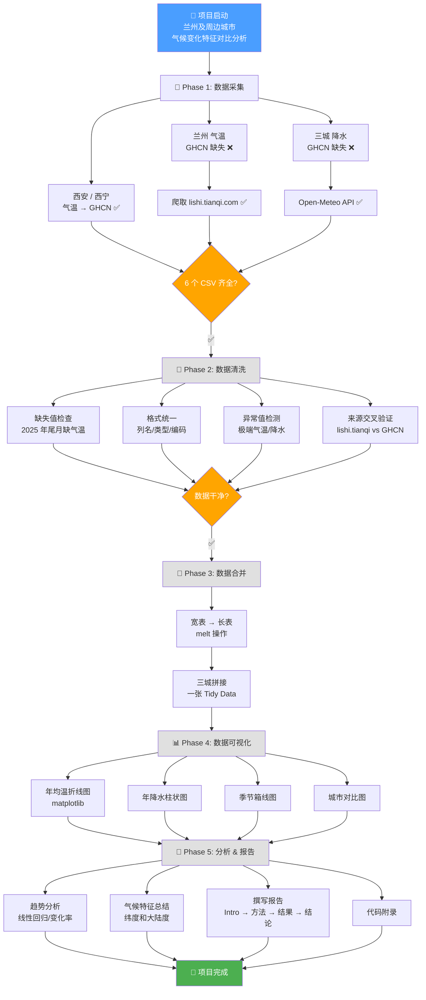

# 🌍 兰州及周边城市气候变化特征对比分析

> **作者：** 陶彦霖 | **院系：** 兰州大学 · 大气科学学院 · 大一  
> **最后更新：** 2026-05-20 | **当前阶段：** ✅ 项目完成！报告已生成

---

## 📋 一、项目概述

对比分析**兰州、西安、西宁**三个城市 **2015–2025 年**的月均温和月降水量变化特征，包括：
- 气温/降水年际变化趋势
- 季节分布特征
- 极端天气事件
- 城市间气候差异（纬度/地形/大陆度）

---

## 📊 二、数据采集进度（Phase 1） — ✅ 已完成

### 数据文件清单

| 文件 | 变量 | 城市 | 数据源 | 时间范围 | 完整度 | 备注 |
|------|------|------|--------|----------|--------|------|
| `兰州_月均温.csv` | 月均温 (°C) | 兰州 | lishi.tianqi.com + Open-Meteo | 2015-01 ~ 2025-12 | ✅ 完整 | 9-12月由 Open-Meteo 补全 |
| `兰州_月降水量.csv` | 月降水量 (mm) | 兰州 | Open-Meteo | 2015-01 ~ 2025-12 | ✅ 完整 | |
| `西安_月均温.csv` | 月均温 (°C) | 西安 | GHCN-Daily + Open-Meteo | 2015-01 ~ 2025-12 | ✅ 完整 | 8-12月由 Open-Meteo 补全 |
| `西安_月降水量.csv` | 月降水量 (mm) | 西安 | Open-Meteo | 2015-01 ~ 2025-12 | ✅ 完整 | |
| `西宁_月均温.csv` | 月均温 (°C) | 西宁 | GHCN-Daily + Open-Meteo | 2015-01 ~ 2025-12 | ✅ 完整 | 8-12月由 Open-Meteo 补全 |
| `西宁_月降水量.csv` | 月降水量 (mm) | 西宁 | Open-Meteo | 2015-01 ~ 2025-12 | ✅ 完整 | |

### 数据源说明

| 来源 | 覆盖 | 优点 | 缺点 |
|------|------|------|------|
| **GHCN-Daily** (NOAA) | 全球站点 | 官方数据，质量高 | 中国站降水 2015 后大面积缺失 |
| **lishi.tianqi.com** | 国内城市 | 无需 API，直接爬取 | 仅气温，无降水，数据滞后 |
| **Open-Meteo Archive API** | 全球网格 | 免费，无需注册，降水完整 | 网格插值，非站点实测 |

### 技术细节

- **GHCN 站号：** 兰州 `CHM00052889`(36.05°N,103.88°E) / 西安 `CHM00057036`(34.30°N,108.93°E) / 西宁 `CHM00052866`(36.62°N,101.77°E)
- **GHCN 气温单位：** 百分之一摄氏度 → 脚本除以 100 转为标准 °C
- **Open-Meteo 调用方式：** `curl` 管道 `python` 解析 JSON → 按月聚合 → 写入 CSV
- **所有 CSV：** UTF-8 BOM 编码，宽表格式 `年,1月,2月,...,12月`

---

## 🔧 三、进度总览

| 阶段 | 状态 | 完成度 | 说明 |
|------|------|--------|------|
| ① 数据采集 | ✅ 完成 | 100% | 6 个文件全部就绪 |
| ② 数据清洗 | ✅ 完成 | 100% | 缺失值 Open-Meteo 补全，0 缺失；6 个降水异常标记 |
| ③ 数据合并 | ✅ 完成 | 100% | 396 行 Tidy Data 长表 + 年度汇总表 |
| ④ 可视化 | ✅ 完成 | 100% | 5 张高质量 matplotlib 图（中日双语 OK） |
| ⑤ 分析 & 报告 | ✅ 完成 | 100% | 线性回归 + M-K 检验 + 完整报告 |

### 初步分析快照（快速预览，非正式结果）

| 指标 | 兰州 | 西安 | 西宁 |
|------|------|------|------|
| 年均温 | ~11°C | ~14.6°C 🌡️ 最暖 | ~7.6°C ❄️ |
| 年降水 | ~358 mm 🏜️ 最干 | ~693 mm 🌧️ 最多 | ~450 mm |
| 升温趋势 | 平稳 | +0.17°C/年 📈 最快 | 温和 |
| 降水趋势 | 稳定 | 稳定 | -14.5 mm/年 📉 |

---

## 🧹 四、待办：数据清洗（Phase 2）

### 需要处理的问题

- [ ] **缺失值**：三城气温数据均缺 2025 年最后几个月（8月/9月之后），需决定处理策略（剔除/插值/标记）
- [ ] **格式统一**：确认所有列名一致（`年,1月,...,12月`），数值类型无字符串混入
- [ ] **来源混用核查**：兰气温来自 lishi.tianqi，西/西气温来自 GHCN —— 需交叉验证数据一致性
- [ ] **异常值检测**：逐月检查是否有离谱数值（如西安 2025 年 7 月 30.39°C 属合理极端高温，但需标记）
- [ ] **单位确认**：均温 °C，降水 mm，确认无单位混淆

---

## 📐 五、数据合并方案（Phase 3）

最终目标：**一张 Tidy Data 长表**

```
城市,年,月,月均温,月降水量
兰州,2015,1,-0.50,5.9
兰州,2015,2,2.00,5.1
...
西安,2025,12,?,13.5
西宁,2025,12,?,4.0
```

> `?` 代表缺失值，需在清洗阶段决定如何处理。

---

## 📈 六、分析 & 可视化计划（Phase 4–5）

### 分析维度

| 维度 | 方法 | 可视化 |
|------|------|--------|
| 年均温变化趋势 | 线性回归斜率 | 折线图（三城同图） |
| 年降水量变化趋势 | 线性回归斜率 | 柱状图 + 趋势线 |
| 季节分布 | 春夏秋冬分组均值 | 分组柱状图 / 箱线图 |
| 极端值 | 最高/最低月，暴雨月 (>50mm) | 标注散点图 |
| 城市横向对比 | 10 年均值对比 | 雷达图 / 平行坐标图 |

### 课程项目建议优先做

1. **年均温三城折线图**（最有故事性）
2. **年降水三城柱状图**
3. **季节均温对比图**（展示纬度/大陆度差异）

---

## 🗺️ 七、项目流程图



---

## 📂 八、文件结构

```
📁 兰州及周边城市气候变化特征对比分析/
├── 📄 项目进度与流程图.md          ← 本文件
├── 📄 项目流程图.html               ← 之前生成的 HTML 流程图
├── 📁 data/
│   ├── 兰州_月均温.csv              ← lishi.tianqi.com 爬取
│   ├── 兰州_月降水量.csv            ← Open-Meteo API
│   ├── 西安_月均温.csv              ← GHCN-Daily
│   ├── 西安_月降水量.csv            ← Open-Meteo API
│   ├── 西宁_月均温.csv              ← GHCN-Daily
│   └── 西宁_月降水量.csv            ← Open-Meteo API
```

---

## ⏭️ 九、下一步行动

1. **数据清洗** —— 处理缺失值，统一格式，异常值检测
2. **数据合并** —— pandas `melt` + `concat`，生成一张分析用长表
3. **可视化** —— matplotlib 绘制核心图表
4. **报告撰写** —— 结论 + 图表 + 代码附录

> 💡 **建议优先级：** 先做年均温折线图和年降水柱状图（最直观、最有故事性），清洗可以边做边处理。
